# Agent Teams Execution

Phased agent team with adversarial review loops and tiered information trust.

## Delegation Rules

- Start this pipeline only when the user explicitly requested subagents, delegation, or parallel agent work.
- Use `spawn_agent`, `send_input`, and `wait_agent` for role execution.
- Map explorers/reviewers to `explorer`; map executors/designers/verifiers to `worker` or `default`.
- Give every worker explicit file/module ownership and warn that other agents may edit in parallel.
- If delegation is not authorized, do not run this pipeline; execute locally with the relevant review checklist.
- `CODEX_ROLE` gates independent Codex CLI sessions launched through `~/.codex/bin/codex-as-role`.

**Core principle:** Explorers gather hard facts, designer architects from facts, adversarial reviewers tear apart every deliverable, executors loop with reviewers until approved, QA validates the big picture. Coordinator manages logistics, lead audits rule compliance. Neither implements.

The PreToolUse gate `ate-orchestrator-gate.sh` denies direct Edit/Write/MultiEdit when `CODEX_ROLE` is `lead` or `coordinator`. If the gate fires, spawn the appropriate teammate and assign the task — do not unset `CODEX_ROLE` to bypass it.

Lead and coordinator stops go through the standard stop-checklist proof flow (`stop-gate.sh` does NOT exempt them). The proof must walk `~/.codex/hooks/stop-checklist.md` and critically analyze items that could not be fully complied with during the role's tenure. Disengaging by unsetting `CODEX_ROLE` to escape the gate is itself a violation flagged by the rule-compliance self-audit.

**Parallelism principle:** Never serialize independent work. Parallelize everything that can be parallelized.

**No urgency. Infinite time.** Never prioritize speed over discipline. Every shortcut, skipped review, or "good enough" degrades the final result. Do it right, every time.

<CRITICAL>
When delegation is authorized, spawn bounded Codex agents with explicit roles, disjoint write ownership, and concrete expected outputs.

Example authorized mapping: one `explorer` for each independent research slice, one `worker` for implementation ownership, and one `explorer` or `default` reviewer for critique.

**Only skill-defined roles.** Name by role (`executor-1`, `explorer-2`). Reassign idle teammates instead of spawning new ones.
</CRITICAL>

## Pipeline Model

**Per-task pipelines.** Research and design are global (produce overall architecture + task breakdown). After that, each task flows through its own pipeline independently:

| Stage | Scope | When it starts |
|-------|-------|---------------|
| Research | Global | Immediately |
| Design | Global | After research |
| Execution + review | Per task | After design approved. Executor writes unit tests with the code. |
| Testing + review | Per task | After that task's code approved. Covers integration/E2E tests. |

**Final QA:** After all per-task pipelines complete, QA performs full end-to-end verification of everything touched — runs all tests, checks all requirements, validates the integrated whole. This is not a pipeline stage but a separate final gate.

### User Followups

After the team reports a QA verdict, the user may send followups (bug reports, tweaks, new features, questions). Coordinator routes each followup through **as much of the full pipeline as reasonably applies** — never skip stages for "small" requests.

| Followup type | Pipeline |
|---------------|----------|
| Question / clarification | Explorer → answer to user. No code. |
| Trivial config tweak (1-line, no logic) | Executor → Reviewer → QA |
| Bug fix | Executor → Reviewer → Test Designer → Test Executor → Test Reviewer → QA |
| Behavior change in existing feature | Designer → Design Reviewer + Fundamentals Reviewer → full Phase 3 + 4 → QA |
| New feature | Full pipeline: Research → Design → both Design Reviewers → Phase 3 → Phase 4 → QA |

**Default: when in doubt, run more pipeline, not less.** Skipping stages for "small" requests is how regressions ship. Coordinator justifies any skipped stage with explicit reasoning to lead + snitch.

## Roles

| Role | Count | Phase | Responsibility |
|------|-------|-------|---------------|
| **Coordinator** | 1 | all | Task assignment, routing, phase management. Requests spawns from lead. **Never implements.** |
| **Lead** | 1 | all | Spawns teammates. Audits coordinator's rule compliance. Reminds coordinator when it forgets enforcement. **Never implements.** |
| **Explorer** | 1+ | 1 | Gather facts. Tag sources. Challenge each other. |
| **Designer** | 1 | 2 | Architect from findings. Produce file ownership map. |
| **Design Reviewer** | 1+ | 2 | Adversarial design review against the design itself. Report only, never edit design. 2+ for large tasks. |
| **Fundamentals Design Reviewer** | 1 | 2 | Runs in parallel with Design Reviewer. Challenges design fundamentals, not surface issues. Spawns 3 subagents via spawn_agent tool: (1) brainstormer — list possible fundamental issues (premise, problem framing, architectural axioms, hidden assumptions, scope, alternatives); (2) reviewer — investigate design against each listed issue and report; (3) meta-reviewer — critically review the reviewer's report for missed angles, weak evidence, rubber-stamping. Report only, never edit design. |
| **Executor** | 1+ | 3 | Implement assigned task + unit tests. One per independent unit of work. Actively look for code smell and design issues in code they study/touch, report all to coordinator. Broken infra or resorting to a workaround = notify coordinator before proceeding. |
| **Execution Reviewer** | 1+ | 3 | Paired 1:1 with executors. Adversarial code review. Report only, never edit code. |
| **Test Designer** | 1 | 3 | Write test specs. Waits for interface contracts. |
| **Test Executor** | 1+ | 4 | Implement tests from specs. |
| **Test Reviewer** | 1+ | 4 | Paired with test executors. Report only, never edit tests. |
| **Verifier** | 1+ | per task | For lightweight tasks (no code, no test pipeline). Adversarially checks deliverable against all expectations. Replaces test pipeline when testing is N/A. |
| **Brainstormer** | 1 | any | On-demand when a blocker emerges. Genius creative unblocker — thinks outside the box. Lists as many solution ideas as possible. Positives only — no negatives, no filtering, no feasibility judgment. Bigger list = better. |
| **Snitch** | 1 | all | CCed on all submitted/blocked/completed claims and QA verdicts. Independently verifies all rules are followed. Notifies lead on any violation. Success = finding violations that the lead confirms. The more confirmed violations found, the better. May pushback once per report if lead dismisses — must quote the exact rule/requirement violated and explain why no workaround is acceptable. On QA approvals, looks for gaps in testing — insufficient coverage, proxy-only evidence where direct was possible, untested criteria. On every reviewer APPROVED message, runs rubber-stamp check: compare reviewer findings against executor's critique log. Reviewer citing zero issues beyond executor self-reports = flag to lead. Lead demands reviewer either (a) confirm self-reported issues are adequately fixed with cited evidence, or (b) find at least one independent issue, or (c) confirm the artifact has none after scrutinizing each checklist item. Sets up hourly cron job whose prompt includes: role description, instruction to re-invoke this skill, then scan all teammates' output for violations and detect dead agents (context limit, API quota, crashes). Disables cron when team is idle (coordinator notifies), re-enables when execution resumes. |
| **QA** | 1 | final | Final integration check. Runs all tests. Last gate. |

### Team Sizing

One executor pair per independent unit of work. ~4 agents per phase before coordination overhead; above that ensure strictly independent work.

## Mandatory Compliance

**Every teammate** must invoke `agent-teams-execution` skill via skill instructions as their first action. Lead **must include this instruction in every spawn prompt**. Coordinator and lead: re-invoke the skill after every context compaction.

**Hourly skill re-read (coordinator, lead, snitch).** Each sets up a cron that fires every 60 minutes with a prompt: "Re-invoke `agent-teams-execution` skill via skill instructions, then resume your role duties (audit / scan / coordinate)." Prevents rule drift over long sessions. Disable cron when team is idle (user-waiting), re-enable on execution resume.

### Model and Effort Level

All teammates: configured Codex model, xhigh effort. Spawn every teammate with `reasoning_effort: "xhigh"` and omit model overrides unless the user explicitly requested one. Launch every independent Codex teammate with `-c 'model_reasoning_effort="xhigh"'`.

### Critical Analysis of All Inputs

No input trusted by default — including peer messages. Never praise peer output. "Excellent work" is not analysis — it's the opposite. When receiving any input from another agent, your first response must identify at least one concern, gap, or question. Verify before building on it. Flag contradictions to coordinator. You own bugs from unverified inputs.

### Claim Verification

Tag every factual claim: `[T<tier>: <source>, <confidence>]`

| Tier | Source | Treatment |
|------|--------|-----------|
| **T1** | Specs, RFCs, official docs, source code | Trusted directly |
| **T2** | Academic papers, established references | High trust; verify if contested |
| **T3** | Codebase analysis (code, tests, git history) | Trust for local facts |
| **T4** | Community (SO, blogs, forums) | Verify independently |
| **T5** | LLM training recall (no source) | **Promote to T1-T4 or discard** |

Confidence: `high` (directly stated), `medium` (logically derived), `low` (indirect). T5 unacceptable in final output. Higher tier wins contradictions. What can be fact-checked, must be.

### Mandatory Skills

| Condition | Skill |
|-----------|-------|
| Debugging | `systematic-debugging` + `debugging-discipline` |
| Go code (*.go) | `go-coding-style` |
| Python code (*.py) | `python-coding-style` |
| Tests | `testing-discipline` |
| Code implementation | `test-driven-development` |
| Logic implementation | `proof-driven-development` |
| Android device | `android-device` |

Executors invoke coding style + `proof-driven-development` + `test-driven-development`. Test executors invoke `testing-discipline`. Lead copies exact skill names into spawn prompts. Determine language from design doc, include matching coding style skill. No placeholders.

**Code quality — semantic integrity is non-negotiable:**
- Names are contracts: implementation fulfills exactly what the name promises. No smuggled decisions or side effects.
- Same concept = same name everywhere. Related concepts use parallel structure.
- Strong typing for domain concepts. No bare primitives where named types belong.
- Package/binary scope: code belongs in the binary whose stated purpose matches the code's function. A standalone CLI tool must not contain code requiring a running daemon.
- Clean solution over hack, always. Reviewers reject shortcuts, workarounds, and "good enough for now."
- Interface implementation is a contract: "I fulfill this interface." An always-erroring implementation is a false claim — same as naming a function Save that doesn't save. Stub implementations that always error must not exist in production code.

### Task States

| Skill state | System state | Meaning | Who sets it |
|-------------|-------------|---------|-------------|
| **pending** | pending | Created, not yet started | Coordinator |
| **blocked_by_task** | pending | Waiting for another task to complete first | Coordinator |
| **in_progress** | in_progress | Agent is actively working on it | Assigned agent |
| **blocked** | in_progress | Cannot proceed — needs resolution | Assigned agent (CC lead + snitch) |
| **exploring** | in_progress | Explorer investigating (research phase or blocker investigation) | Coordinator |
| **unblocking** | in_progress | Brainstormer + explorer working to resolve blocker | Coordinator (after blocker reported) |
| **submitted** | in_progress | Agent believes done, awaiting verification | Assigned agent (CC lead + snitch) |
| **in_review** | in_progress | Reviewer is actively reviewing | Coordinator (after submission checklist passes) |
| **in_test_design** | in_progress | Test designer writing test specs (code tasks only) | Coordinator (after reviewer approves) |
| **in_testing** | in_progress | Test executor implementing and running tests (code tasks only) | Coordinator (after test specs ready) |
| **in_verification** | in_progress | Verifier adversarially checking (non-code tasks) | Coordinator (after reviewer approves) |
| **complete** | completed | Proved done — reviewed, tested, evidence provided. ONLY after full verification | Coordinator |

**Transition requirements:**

| Transition | Requirements |
|------------|-------------|
| pending → in_progress | Agent assigned. Executors: pair invariant satisfied (reviewer alive) |
| pending → exploring | Research task: route to explorer |
| exploring → submitted | Explorer findings complete (research-only tasks). CC lead + snitch |
| exploring → in_progress | Exploration done, task needs execution next. Executors: pair invariant satisfied |
| pending → blocked_by_task | Task depends on another task that isn't complete yet |
| blocked_by_task → in_progress | Blocking task completed. Agent assigned |
| in_progress → blocked | Agent reports specific blocker. CC lead + snitch |
| blocked → unblocking | Coordinator launches brainstormer + explorer simultaneously per Blocker Resolution Protocol |
| unblocking → in_progress | Feasible solution found and assigned. Blocker resolved |
| unblocking → blocked | No feasible solution found. Escalate to user |
| in_progress → submitted | All claims tagged `[T<tier>: source, confidence]`. Critique log produced (3+ problems found/fixed). Code tasks: all changes committed, hard proof that the solution works (test output, command output, screenshots). CC lead + snitch |
| submitted → in_progress | Coordinator bounces back: submission checklist failed |
| submitted → in_review | Coordinator verifies submission checklist passes. Routes to paired reviewer |
| in_review → in_progress | Reviewer rejected. Routes back to executor with feedback |
| in_review → in_test_design | Reviewer approved with evidence. Code tasks only: route to test designer for specs |
| in_test_design → in_testing | Test specs ready. Route to test executor |
| in_test_design → in_progress | Test designer finds interface contracts wrong/incomplete. Routes back to executor |
| in_review → in_verification | Reviewer approved with evidence. Non-code tasks: route to verifier |
| in_testing → complete | Tests implemented and passing. Test reviewer approved. CC lead + snitch |
| in_testing → in_progress | Tests reveal bugs. Routes back to executor |
| in_verification → complete | Verifier approved with evidence against all expectations. CC lead + snitch |
| in_verification → in_progress | Verifier found issues. Routes back to executor |

**No agent can set a task to "complete"** — only the coordinator after all verification passes. No git push without user request. Lead enforces all transitions.

### Git & Security

- `git diff` for secrets before every commit. Static checks before every commit. Never push without user approval. No AI co-author lines.
- Security first. Never disable security features. OWASP top 10 for all code. Validate at system boundaries.

## Flow (per-task after design)

```dot
digraph phases {
    rankdir=TB;

    "PHASE 1: RESEARCH" [shape=doublecircle];
    "Spawn explorers" [shape=box];
    "Explore and cross-check findings" [shape=box];
    "All findings tagged with source tier?" [shape=diamond];
    "T5 claims remaining?" [shape=diamond];
    "Promote or discard T5 claims" [shape=box];
    "Produce findings document" [shape=doublecircle];

    "PHASE 2: DESIGN" [shape=doublecircle];
    "Spawn designer + design reviewer(s)" [shape=box];
    "Design architecture + file ownership map" [shape=box];
    "Design reviewer approves?" [shape=diamond];
    "Revise design based on feedback" [shape=box];
    "Designer needs more info?" [shape=diamond];
    "Re-spawn explorers for targeted research" [shape=box];
    "Finalize approved design + file ownership" [shape=doublecircle];
    "STOP: 10 rejections - escalate to user" [shape=octagon, style=filled, fillcolor=red, fontcolor=white];

    "PHASE 3: EXECUTION" [shape=doublecircle];
    "Spawn executor/reviewer pairs + test designer" [shape=box];
    "Implement module (owns assigned files only)" [shape=box];
    "Execution reviewer approves?" [shape=diamond];
    "Revise code based on feedback" [shape=box];
    "Executor blocked by design issue?" [shape=diamond];
    "Report to lead - re-enter Phase 1" [shape=box];
    "Write test specs (wait for interface contracts)" [shape=box];
    "Finalize test specs" [shape=doublecircle];
    "Task code approved" [shape=doublecircle];
    "STOP: 10 exec rejections - escalate" [shape=octagon, style=filled, fillcolor=red, fontcolor=white];

    "PHASE 4: TESTING + INTEGRATION" [shape=doublecircle];
    "Spawn test executor/reviewer pairs" [shape=box];
    "Implement unit + integration tests from specs" [shape=box];
    "Test reviewer approves?" [shape=diamond];
    "Revise tests based on feedback" [shape=box];
    "Confirm all tests pass" [shape=doublecircle];
    "STOP: 10 test rejections - escalate" [shape=octagon, style=filled, fillcolor=red, fontcolor=white];

    "FINAL QA" [shape=doublecircle];
    "Spawn QA" [shape=box];
    "Verify against full checklist" [shape=box];
    "QA approves?" [shape=diamond];
    "Route: bug->Ph3, design flaw->Ph1, missing test->Ph4, bad finding->Ph1" [shape=box];
    "Report verdict + evidence to user. Wait." [shape=box];
    "User confirms?" [shape=diamond];
    "User followup?" [shape=diamond];
    "Route per User Followups table" [shape=box];
    "Wait for user shutdown request" [shape=doublecircle];
    "STOP: 2 QA re-entries exhausted - escalate to user" [shape=octagon, style=filled, fillcolor=red, fontcolor=white];

    "PHASE 1: RESEARCH" -> "Spawn explorers";
    "Spawn explorers" -> "Explore and cross-check findings";
    "Explore and cross-check findings" -> "All findings tagged with source tier?";
    "All findings tagged with source tier?" -> "Explore and cross-check findings" [label="no"];
    "All findings tagged with source tier?" -> "T5 claims remaining?" [label="yes"];
    "T5 claims remaining?" -> "Promote or discard T5 claims" [label="yes"];
    "Promote or discard T5 claims" -> "T5 claims remaining?";
    "T5 claims remaining?" -> "Produce findings document" [label="no"];

    "Produce findings document" -> "PHASE 2: DESIGN";
    "PHASE 2: DESIGN" -> "Spawn designer + design reviewer(s) + fundamentals reviewer";
    "Spawn designer + design reviewer(s) + fundamentals reviewer" -> "Design architecture + file ownership map";
    "Design architecture + file ownership map" -> "Design reviewer approves?";
    "Design architecture + file ownership map" -> "Fundamentals reviewer approves?";
    "Fundamentals reviewer approves?" [shape=diamond];
    "Fundamentals reviewer approves?" -> "Revise design based on feedback" [label="no (round 1-10)"];
    "Fundamentals reviewer approves?" -> "STOP: 10 rejections - escalate to user" [label="no (round 11+)"];
    "Fundamentals reviewer approves?" -> "Both reviewers approved?" [label="yes - with evidence"];
    "Both reviewers approved?" [shape=diamond];
    "Design reviewer approves?" -> "Revise design based on feedback" [label="no (round 1-10)"];
    "Design reviewer approves?" -> "STOP: 10 rejections - escalate to user" [label="no (round 11+)"];
    "Design reviewer approves?" -> "Both reviewers approved?" [label="yes - with evidence"];
    "Both reviewers approved?" -> "Finalize approved design + file ownership" [label="yes"];
    "Both reviewers approved?" -> "Design architecture + file ownership map" [label="no - wait for other"];
    "Revise design based on feedback" -> "Designer needs more info?";
    "Designer needs more info?" -> "Re-spawn explorers for targeted research" [label="yes"];
    "Re-spawn explorers for targeted research" -> "Design architecture + file ownership map";
    "Designer needs more info?" -> "Design architecture + file ownership map" [label="no"];
    "Design reviewer approves?" -> "Finalize approved design + file ownership" [label="yes - with evidence"];

    "Finalize approved design + file ownership" -> "PHASE 3: EXECUTION";
    "PHASE 3: EXECUTION" -> "Spawn executor/reviewer pairs + test designer";
    "Spawn executor/reviewer pairs + test designer" -> "Implement module (owns assigned files only)";
    "Spawn executor/reviewer pairs + test designer" -> "Write test specs (wait for interface contracts)";
    "Implement module (owns assigned files only)" -> "Execution reviewer approves?";
    "Execution reviewer approves?" -> "Revise code based on feedback" [label="no (round 1-10)"];
    "Execution reviewer approves?" -> "STOP: 10 exec rejections - escalate" [label="no (round 11+)"];
    "Revise code based on feedback" -> "Executor blocked by design issue?";
    "Executor blocked by design issue?" -> "Report to lead - re-enter Phase 1" [label="yes"];
    "Report to lead - re-enter Phase 1" -> "Spawn explorers";
    "Executor blocked by design issue?" -> "Execution reviewer approves?" [label="no - retry"];
    "Execution reviewer approves?" -> "Task code approved" [label="yes - with evidence"];
    "Write test specs (wait for interface contracts)" -> "Finalize test specs";

    "Task code approved" -> "PHASE 4: TESTING + INTEGRATION" [label="immediately, per task"];
    "Finalize test specs" -> "PHASE 4: TESTING + INTEGRATION";
    "PHASE 4: TESTING + INTEGRATION" -> "Spawn test executor/reviewer pairs";
    "Spawn test executor/reviewer pairs" -> "Implement unit + integration tests from specs";
    "Implement unit + integration tests from specs" -> "Test reviewer approves?";
    "Test reviewer approves?" -> "Revise tests based on feedback" [label="no (round 1-10)"];
    "Test reviewer approves?" -> "STOP: 10 test rejections - escalate" [label="no (round 11+)"];
    "Revise tests based on feedback" -> "Test reviewer approves?";
    "Test reviewer approves?" -> "Confirm all tests pass" [label="yes - with evidence"];

    "Confirm all tests pass" -> "FINAL QA" [label="after all per-task pipelines complete"];
    "FINAL QA" -> "Spawn QA";
    "Spawn QA" -> "Verify against full checklist";
    "Verify against full checklist" -> "QA approves?";
    "QA approves?" -> "Route: bug->Ph3, design flaw->Ph1, missing test->Ph4, bad finding->Ph1" [label="no (re-entry 1-2)"];
    "QA approves?" -> "STOP: 2 QA re-entries exhausted - escalate to user" [label="no (re-entry 3+)"];
    "Route: bug->Ph3, design flaw->Ph1, missing test->Ph4, bad finding->Ph1" -> "Verify against full checklist";
    "QA approves?" -> "Report verdict + evidence to user. Wait." [label="yes - all evidence cited"];
    "Report verdict + evidence to user. Wait." -> "User followup?";
    "User followup?" -> "Route per User Followups table" [label="yes"];
    "Route per User Followups table" -> "PHASE 1: RESEARCH" [label="new feature"];
    "Route per User Followups table" -> "PHASE 2: DESIGN" [label="behavior change"];
    "Route per User Followups table" -> "PHASE 3: EXECUTION" [label="bug fix / tweak"];
    "User followup?" -> "User confirms?" [label="no"];
    "User confirms?" -> "Wait for user shutdown request" [label="yes"];
    "User confirms?" -> "Report verdict + evidence to user. Wait." [label="no - keep waiting"];
}
```



## Checkpoints & Re-Entry

After each task milestone (code approved, tests approved), coordinator records: **what was produced**, **who approved** (with evidence), **git SHA**.

**Re-entry impact assessment:** Diff old vs new design. Invalidate only pairs touching changed interfaces (reset loop counters). Notify test designer. Unaffected tasks continue their pipelines.

## Design Output Requirements

Phase 2 design **must include**:
1. **Architecture** -- components, data flow, error/failure flow, interfaces
2. **File ownership map** -- no overlaps. Spawn prompts include: "You own ONLY these files: [list]."
3. **Binary/service purpose map** -- for each binary or deployable, one-sentence statement of purpose, scope, and dependencies. File ownership map must be consistent with this.
4. **Interface contracts** -- public APIs/signatures per task, including: error/failure modes, preconditions/postconditions, data invariants, thread safety. Test designer uses these before executors finish.
5. **Module dependency graph** -- coordinator uses for executor sequencing.
6. **Requirement traceability** -- component → user requirement mapping. Every requirement covered, every component justified.
7. **Security design** (when applicable) -- trust boundaries, attack surfaces, security controls, auth strategy. OWASP at design time, not just code review.
8. **Shared concerns register** -- logic/types/patterns needed by 2+ tasks. Each entry: {what, which tasks, designated shared location}. Executors consume this to avoid reimplementation.

**Git worktrees:** 2+ parallel executors -> each gets own worktree. Create before spawning, merge after approval.

## Testing Protocol

**Unit tests:** Written by executors alongside their code. Part of execution, not a separate phase.

**Integration/E2E tests (Phase 4):**
- **Test designer** writes specs covering all applicable test types: integration tests (cross-task boundaries), full E2E tests (entire user-facing flows), and UI tests (screen manipulation, interaction sequences) when the project has a UI.
- Every cross-task interface must have at least one test on the real call path (no mocks at boundaries).
- E2E tests exercise complete workflows as a user would, including UI manipulation when applicable.
- **Failure routing:** cross-task boundary bug → executor pair. Design flaw → research/design.

## Feedback Loops

Paired roles communicate **directly**. All other feedback routes through coordinator. **All "submitted", "blocked", and "completed" claims must CC both the lead and the snitch** — independent verification that the coordinator doesn't accept claims at face value. **All coordinator → lead requests (spawn, re-spawn, phase transition) must also CC the snitch** — so the snitch can independently verify spawn prompts, checklists, and rule compliance.

| From | To | Trigger | Route |
|------|----|---------|-------|
| Design Reviewer | Designer | Design flaw | Direct (paired) |
| Designer | Explorers | Needs info | Coordinator requests lead to re-spawn |
| Execution Reviewer | Executor | Code issue | Direct (paired) |
| Executor | Coordinator | Design issue or code smell found | Coordinator assigns executor to analyze; minor: executor fixes directly, design-level: full pipeline |
| Test Reviewer | Test Executor | Test issue | Direct (paired) |
| Any agent | Coordinator | Findings received | Coordinator assigns independent verification before accepting |
| Any teammate | Coordinator | Blocker reported | Blocker Resolution Protocol: simultaneously launch brainstormer + explorer |
| QA | Coordinator | Any verdict (approval or rejection) | CC snitch. On approval, QA must demonstrate sufficient testing was performed (which criteria, what evidence, direct vs proxy). On rejection, route by type. Snitch looks for gaps in testing |

### Loop Limits

Round = one rejection (initial submission is not a round).

- **10 rounds max** per pair. 11th rejection -> escalate (replace teammate or re-scope). Counters reset on QA/Phase 2 re-entry.
- **2 QA re-entries max** (total). 3rd -> escalate to user with: what failed, what was tried.
- **2 designer-to-explorer rounds max.** Then escalate to user.

### Crash Recovery

**Not responding to messages ≠ dead.** Coordinator must investigate before declaring unresponsive:
1. Check: does the teammate have an active running process? (compilation, test suite, build, context compaction) → working, not hung.
2. Check: are files or git state changing in their worktree? → working, not hung.
3. If no active process and no file/git activity: **interrupt first** — send a message asking for status, then interrupt if the tool surface supports it. Wait for response.
4. Only if no response after interrupt → confirmed unresponsive.
Skipping any step = false positive. Coordinator must document evidence of all checks before requesting re-spawn.

Once confirmed unresponsive, **immediately** re-spawn — no delays. The task must not stall.
**Executors:** Paired reviewer reviews all changes before re-spawn. Unreviewed output never discarded.
**Non-executors:** Re-spawn immediately. Max 2 re-spawns per role, then escalate to user.

### Misbehavior Recovery (any agent)

**Every violation:** Whoever detects it (lead, coordinator, or snitch) sends the violating agent the specific rule + correction and notifies the other oversight roles (lead, coordinator, snitch). Interrupt immediately when the tool surface supports it. No violation goes uninterrupted.

**Repeated violations (3+ on same rule):** Counts only corrections the agent received and still violated afterward. Acknowledgement not required; receipt is. Coordinator verifies receipt before counting a cycle. Trigger: 3+ confirmed receive-then-violate cycles. Then restart the agent with a fresh prompt to re-read the skill and continue. If still misbehaving, escalate to user.

**Force-deliver corrections.** Agent busy or mid-turn may not see `send_input` until its turn ends. Interrupt when available, then re-send the correction.

### Blocker Resolution Protocol

When any teammate reports a blocker, coordinator simultaneously launches:
1. **Brainstormer** — prompt as a genius creative unblocker who thinks outside the box. Generates as many solution ideas as possible. Positives only, no filtering, no feasibility judgment. Bigger list = better.
2. **Explorer** — independently investigates the blocker to understand the technical landscape.

After brainstormer finishes, coordinator launches a second explorer to validate **technical feasibility** of the brainstormer's ideas against the explorer's findings. Coordinator picks the best feasible approach and assigns it.

## Reviewer Protocol

**ALL reviewers** (design, execution, test):

**Reviewers report, never fix.** No editing code, designs, or tests. Describe the problem and suggest a fix direction. The paired executor implements all changes.

0. **Does it work?** Before evaluating quality, verify code fulfills its stated purpose. If it doesn't — REJECT.
1. **Assume wrong.** Find errors. Look for what's missing.
2. **Classify:** Critical (security, correctness, spec violation), Major (design deviation, missing edge case) — both block. Minor (doesn't block), Nit (never blocks).
3. **Outcomes:** APPROVED (no Critical/Major, with evidence), CONDITIONAL (Minor/Nit listed), REJECTED (Critical/Major cited with fix direction). Every Critical/Major must cite `file:line`. Fix direction must name the exact symbol changed. Vague findings ("refactor this function", "clean this up") are inadmissible. Rejections must enumerate reasons before any approval statement — no mixed verdicts.
4. **Check against:** design doc, coding style skill (semantic integrity, naming, typing, no shortcuts — every rule), OWASP top 10, edge cases, error handling, requirements, claim tags, critique log. No coding style invocation = reject. Untagged factual claims = reject. T5 claims not promoted = reject. No critique log = reject.
5. **Max 10 rounds** then escalate.

Design creates a type/component but defers making it work = reject. Valid deferral: don't create it yet. Invalid deferral: create a broken version.

### Design Reviewer — Additional Rejection Criteria

REJECT if any are missing or incomplete:
- Requirement traceability (item 6) — every requirement mapped, every component justified
- Security design (item 7, when applicable) — trust boundaries, attack surfaces, controls
- Shared concerns register (item 8) — all cross-task logic/types identified with designated locations
- Enriched interface contracts (item 4) — error modes, pre/postconditions, invariants, thread safety
- File ownership map contradicts binary/service purpose map (items 2 vs 3)

### Execution Reviewer Checklist

Extends the general Reviewer Protocol above (which already covers OWASP, edge cases, error handling, claim tags, critique log). Execution reviewers additionally check:

- [ ] Load the `<language>-coding-style` skill via skill instructions. Check every rule.
- [ ] Requirements coverage — each user requirement → code
- [ ] Design compliance — implementation matches architecture + interface contracts (error modes, pre/postconditions, invariants, thread safety)
- [ ] Code location — files in correct binary per purpose map
- [ ] Shared concerns register — no reimplementation (REJECT); missed abstraction (CONDITIONAL)

### Executor Disputes

Dispute a finding with evidence: cite code, spec, or test. Reviewer withdraws or escalates with stronger evidence. One exchange, then coordinator decides.

### Multi-Reviewer (2+)

Review independently first — no reading peer findings before writing your own. Minority dissent requires counter-evidence to override. T1 outweighs T3.

**Lens partition.** Coordinator assigns non-overlapping lenses, allocated in priority order: (1) correctness/edge cases, (2) security/OWASP, (3) design/semantic integrity/naming. With 2 reviewers: lenses 1+2. With 3 reviewers: lenses 1+2+3. With 4+: split correctness into happy-path vs edge-case, or split design into naming vs architecture. Each reviewer produces findings under its lens before lenses converge. Issues outside a lens are still reported, but lens coverage is primary. Identical spawn prompts for sibling reviewers = reject.

## QA Protocol

**Four-step protocol applied to every acceptance criterion:**

1. **State** — explicitly state what must be true (the criterion)
2. **Identify** — identify what evidence would prove it, distinguishing **direct** from **proxy**:
   - **Direct evidence**: shows the thing itself working (running the actual program end-to-end, observing the output, reproducing the user-facing flow)
   - **Proxy evidence**: indirect signal (unit tests pass, linter clean, type check passes)
3. **Obtain** — actually obtain the evidence. Run the commands. Execute the program. Reproduce the flow. **Always prefer direct evidence.** Proxy evidence alone never satisfies a criterion that can be verified directly.
4. **Judge** — judge whether the evidence proves the criterion. Cite the exact output/observation. "Looks right" is not judgment — quote the evidence.

**Acceptance criteria checklist:**

- [ ] Implementation matches design
- [ ] All original requirements met
- [ ] All claims tagged, no T5 remaining
- [ ] OWASP top 10 security review
- [ ] Edge cases handled
- [ ] Integration tests pass (run them — direct)
- [ ] All unit tests pass (run them — proxy, still required)
- [ ] End-to-end flows verified (direct — run the program as a user)
- [ ] No uncommitted changes, no secrets in diffs
- [ ] Static checks pass
- [ ] Mandatory skills invoked by all teammates
- [ ] Critique logs exist for all teammates
- [ ] File ownership respected
- [ ] Code quality: clean code, semantic integrity, no shortcuts, no workarounds, coding style fully followed

## Coordinator Responsibilities

**NEVER do implementation work.** No code, research, exploration, investigation, or analysis. Your context is coordination state; work flows to teammates through the lead and the approved Codex agent mechanism. Agents make mistakes — never trust claims at face value. Reviewers validate completion; launch explorers to verify blockers and external blame.

**PAIR INVARIANT (hard rule):** Every executor MUST have its paired reviewer spawned and confirmed BEFORE the executor receives any task. Never assign new work to the same executor whose previous submission is unreviewed — assign it to a different executor/reviewer pair instead. Sequence per pair: spawn reviewer -> confirm alive -> spawn executor -> executor implements -> reviewer reviews -> loop until approved -> only then may this executor receive next task. While a pair is in review, other pairs work in parallel. Violating this invariant is a skill violation equivalent to writing code.

1. **Track EVERYTHING as tasks.** Every deliverable, sub-task, blocker = task. Task list is single source of truth.
2. **Request spawns from lead.** Coordinator determines who is needed and when; lead creates the agent team and spawns teammates.
3. **Tasks with dependencies first**, then request lead to spawn teammates to claim them. Every task description must include: "Tag all factual claims: `[T<tier>: source, confidence]`."
4. **Assign file ownership** per design doc. **Create git worktrees** for 2+ parallel executors.
5. **Route feedback** between unpaired roles. When receiving findings from any agent: do NOT acknowledge with praise. Identify what's missing, what could be wrong, what needs verification. Route findings to a second agent for independent verification before acting on them.
6. **Monitor progress.** Stale task = investigate per Crash Recovery: check for active process and file/git activity in their worktree. If confirmed unresponsive, follow the respawn sequence.
7. **Handle "submitted" tasks.** When a task is submitted: verify Stop Checklist items (changes committed, claims tagged, critique log exists). Bounce back immediately if incomplete — don't waste reviewer time. If checklist passes, route to paired reviewer. After reviewer approves, route to test pipeline (code tasks) or verifier (non-code tasks).
8. **Drive per-task pipelines.** When a task's code is approved + its test specs are ready → immediately spawn test executor/reviewer pair for that task. Do not wait for other tasks. After ALL tasks tested → spawn QA. Record checkpoint per task: what was produced, who approved, git SHA.
9. **Budget context** -- summaries, not raw output (see below).
10. **Enforce loop limits.** Escalate on 11th rejection / 3rd QA re-entry.
11. **Crash recovery** -- detect unresponsive teammates, request lead to re-spawn. For executors: review changes before re-spawning. Max 2 re-spawns.
12. **Manage lifetimes** per Teammate Lifecycle (below).
13. **Enforce pair invariant.** Before every executor task assignment, verify reviewer exists and previous work is reviewed.
14. **Address all reported issues.** Every executor-reported issue becomes a task. Assign an executor to critically analyze it (code cleanness, semantic integrity, correctness). If dismissed: document rationale. If validated and minor: the analyzing executor fixes it directly. If validated and design-level: full pipeline. No report may be silently ignored.
15. **Audit subordinates every 10 minutes.** Check each active teammate's recent output for rule violations: untagged claims, missing skill invocations, unreviewed code, shortcuts. Create a task for each violation found.
16. **Interrupt violations immediately.** Same protocol as lead: send correction message first, then interrupt if the tool surface supports it. Do not wait for their turn to end when interruption is available.
17. **Notify snitch on idle/resume.** Message snitch when team goes idle (all tasks waiting on user) and when execution resumes, so snitch can disable/enable its cron job.
18. **Report QA verdict to user, then wait.** Never declare mission accomplished. Never auto-shutdown teammates. Mission complete only when user explicitly confirms. Followups → route per User Followups table.
19. **Shutdown only on user request.** Then run Shutdown procedure for every teammate, mark all tasks completed.

## Lead Responsibilities

**NEVER implement. The lead enforces all skill rules.** Reactive, not proactive — the lead reacts to events rather than actively observing. On every event, the lead verifies that all applicable rules were followed. On violation, the lead reminds the agent of the specific rule and the required correction — never blocks, always corrects.

**Stop-hook bypass (first action, unconditional):** As the very first action on entering this skill — before spawning any teammate — run `~/.codex/bin/skip-stop on`. The main thread never implements code, so the verification gate is pure overhead here. On **any** skill exit (team completion, user abort, escalation halt, fatal error), run `~/.codex/bin/skip-stop off` to clear the marker. Leaving it stale would silently bypass verification in the next normal dev session.

**Interrupting violations:** A message alone is insufficient — agents won't see it until their turn ends. To interrupt:
1. Send the correction with the specific rule + required fix.
2. Interrupt the agent if the tool surface supports it.

**Events and enforcement:**

**On every event:** check for rule violations (untagged claims, missing skills, skipped reviews, shortcuts). Interrupt + remind the violating agent.

| Event | Lead action |
|-------|-------------|
| Coordinator requests reviewer/verifier/QA spawn | Verify spawn checklist. Additionally verify the prompt drives maximum scrutiny: includes original objective, all scrutiny rules, and adversarial framing. Reject weak prompts |
| Coordinator requests other spawn | Verify spawn checklist, create agent team / spawn teammate |
| Coordinator requests re-spawn (crash recovery) | Verify hang proof, then spawn |
| Coordinator reports phase transition | Verify rules were followed: pair invariant, reviews completed, reported issues addressed |
| Coordinator assigns new task to executor | Verify reviewer exists and previous work reviewed |
| Teammate reports coordinator doing work directly | Remind coordinator to delegate |
| Teammate reports unaddressed issue | Remind coordinator to create task and assign analysis |
| CCed "submitted" claim received | Verify the claim has sufficient proof. If not, remind coordinator not to accept it — demand evidence before marking complete |
| CCed blocker claim received | Verify the blocker claim is substantiated. If evidence is thin, remind coordinator to launch verification (explorer) before accepting |
| Reviewer/verifier/QA approves | Scrutinize the approval: does it cite specific evidence? Does it address all scrutiny rules? A shallow "LGTM" is not an approval — send back with specific areas to examine |
| Any agent ignores reminder (3+ on same rule) | Misbehavior Recovery: force `/compact`, re-read skill, continue. If still misbehaving, escalate to user |
| Coordinator not responding | Check tmux panes to see what's happening. Still thinking/processing = acceptable (up to 1 hour). Stuck > 1 hour = re-spawn. Max 2 re-spawns, then escalate to user |
| Coordinator declares mission accomplished without explicit user confirmation | Reject. Force coordinator to report verdict + evidence to user and wait |
| Coordinator initiates shutdown without explicit user request | Reject. Team stays alive for followups |
| Coordinator skips pipeline stages on user followup | Verify against User Followups table. Demand justification or reject |
| Hourly audit (every 60 minutes) | Spot-check agent output for violations coordinator should have caught. Only intervene if coordinator missed them |

### Spawn Checklist (lead verifies before every spawn)

- [ ] Spawn prompt includes instruction: "Invoke `agent-teams-execution` skill via skill instructions as your first action"
- [ ] Stop condition stated as observable criterion; false-stops enumerated
- [ ] Model override omitted unless the user explicitly requested one
- [ ] Reasoning effort set to xhigh
- [ ] Correct coding style skill listed by exact name (not placeholder)
- [ ] Claim tagging instructions included verbatim
- [ ] File ownership explicit (executor/test roles)
- [ ] Paired reviewer confirmed alive (executor spawns only)
- [ ] Reviewer/verifier spawns include: executor's original objective with full context, and all scrutiny rules (coding style, claim tagging, OWASP, semantic integrity, etc.)
- [ ] Execution reviewer spawns include: explicit "Load the `<language>-coding-style` skill via skill instructions" instruction + shared concerns register
- [ ] Preemptive warnings included: coordinator anticipates the most likely mistakes this agent could make given the specific task and explicitly warns against them in the spawn prompt
- [ ] Launched via `codex-as-role <role>` (or env-prefixed `CODEX_ROLE=<role> codex ...`) so the teammate's *process env* carries CODEX_ROLE. Setting CODEX_ROLE inside the spawn-prompt body does NOT propagate — the prompt is text the agent reads, not env. Allowed roles: coordinator, explorer, designer, reviewer, executor, test-designer, test-executor, test-reviewer, verifier, qa, brainstormer, snitch.

Lead rejects spawn if any item unchecked.

### Context Budgeting

Downstream agents get **structured summaries**, not raw upstream output.

| Role | Receives | Excludes |
|------|----------|----------|
| Designer | Explorer findings summary + source tags | Raw tool outputs, full files |
| Executor | Own module's design + interface contracts | Other modules, explorer findings |
| Reviewer | Executor's original objective (with full context), diff, relevant design, enriched interface contracts, shared concerns register, all scrutiny rules (coding style, claim tagging, OWASP, etc.) | Full codebase, other modules |
| Test Executor | Test specs + contracts + public APIs | Implementation details |
| QA | Original objectives (all tasks, with full context), phase summaries, test results, all scrutiny rules | Teammate conversation histories |

### Teammate Lifecycle

| Role | Alive until | Why |
|------|-----------|-----|
| Explorers | Design approved | Designer may need more info |
| Designer + Reviewer | Phase 3 end | Design issues re-enter full pipeline |
| Executors + Reviewers | Phase 4 end | Test failures trace to code |
| Test Designer | Phase 4 end | Test executors need spec clarification |
| Test Executors + Reviewers | User shutdown | User may request followups |
| Snitch | User shutdown | Monitors all claims throughout |
| **QA** | User shutdown | **Re-spawned fresh per QA cycle** |
| Coordinator + Lead | User shutdown | Stand by for user followups |

**No "DONE" state.** QA approval ≠ mission accomplished. After QA approves, coordinator reports verdict + evidence to user and **waits**. Mission is accomplished only when the user explicitly confirms (e.g. "ship it", "done", "approved"). Until then, all teammates remain alive.

**Shutdown only on user request.** Coordinator never auto-shuts down the team. User must explicitly request shutdown ("disband", "end team", "shut down"). Then coordinator runs Shutdown procedure for every teammate.

Re-entry: original designer handles Phase 2 re-entry directly — full context preserved.

**Shutdown procedure:** Always prefer graceful: ask the agent to commit or report any uncommitted work, then request shutdown. If the agent is mid-turn, interrupt when available, then re-send the shutdown request.

If graceful shutdown fails, escalate to the user before terminating independent processes. After a spawned agent is complete, use `close_agent` so future coordination does not wait on a stale agent.

### Spawn Prompt Template

```
You are the [ROLE] for this agent team.

Your task: [SPECIFIC TASK]

Stop when: [OBSERVABLE COMPLETION CRITERION — concrete state, not "when you think it's done"]
Do NOT stop on: [COMMON FALSE-STOPS — e.g. "first draft ready", "happy path works", "build compiles"]

Context:
- Explorer findings: [summary or "see task list"]
- Design doc: [location or "not yet created"]
- File ownership: [YOUR FILES ONLY. Do not edit other files.]

Trust Hierarchy (tag ALL claims):
T1: Specs/RFCs/docs/source -> trusted | T2: Academic -> high trust
T3: Codebase analysis -> local facts | T4: Community -> verify first
T5: Training recall -> MUST promote or discard
Format: [T<tier>: <source>, <confidence: high/medium/low>]

Compliance:
- Critically analyze ALL inputs. You own bugs from unverified inputs.
- BEFORE writing code, invoke applicable skills via the skill instructions:
  go-coding-style (Go), python-coding-style (Python), testing-discipline (tests),
  test-driven-development (code implementation), proof-driven-development (logic),
  systematic-debugging + debugging-discipline (debugging).
  Follow every rule from invoked skills. Reviewer rejects non-compliance.
- Tag ALL factual claims: [T<tier>: <source>, <confidence>]. Untagged claims = reviewer rejection.
- Produce critique log (3+ issues found/fixed) before marking done
- git diff for secrets, static checks before commits, never push

[After both spawned:] Paired with [CONFIRMED NAME]. Message directly.

- [ROLE-SPECIFIC RULES]
- [FOR EXECUTORS:] While implementing, actively look for code smell and design issues in all code you study or touch. Report ALL findings to coordinator — do not silently work around them.
- [FOR EXECUTORS, code/debugging tasks:] Before "submitted": build, run full test suite, exercise the affected feature through real UI/API as a user. Cite direct evidence (output, screenshot, observed state) in submission. Proxy evidence (unit tests, lint) insufficient. No E2E evidence = coordinator bounces back without routing to reviewer.
- Mark task as "submitted" (not "complete") + notify coordinator when done. **CC the lead and snitch on all submitted, blocked, and completed claims.**
- If blocked, message coordinator with specifics. **CC the lead and snitch.**
```

## Red Flags

| Symptom | Fix |
|---------|-----|
| Spawning without a skill-defined role, ownership, or stop condition | STOP. Use bounded Codex agents with explicit role, ownership, and expected output |
| Work without corresponding task | Create task immediately |
| Task waiting for other tasks before testing | Pipelines are per-task. Code approved + test specs ready → start testing immediately |
| Spawning custom-named teammates outside defined roles | Unbounded growth. Use role names: executor-N, explorer-N. Reassign idle teammates. |
| Executor assigned new task with unreviewed previous work | STOP. Assign to a different executor/reviewer pair instead. This executor waits for its reviewer |
| Executor spawned without paired reviewer already alive | STOP. Batch-spawn all reviewers, confirm all alive, then batch-spawn executors |
| Executor using workaround without notifying coordinator | STOP. Executor reports broken infra to coordinator first |
| Executor-reported issue silently ignored | Create task, assign executor to analyze. Validated -> full pipeline. Dismissed -> documented rationale |
| Coordinator or lead doing work (code, research, exploration, analysis) | Delegate to appropriate role |
| Coordinator bypassing lead or doing work directly | STOP. Route through lead and teammate tasks |
| Reviewer editing code/design/tests | STOP. Reviewers report only. Executor implements fixes |
| Agent praising peer output ("Great work!", "Excellent finding!") instead of critically analyzing it | No input trusted by default. Find what's wrong |
| Reviewer approving without evidence | Re-spawn with stricter prompt |
| T5 in explorer findings | Send back to verify or discard |
| Two teammates editing same file | Check file ownership map; reassign |
| No file ownership map in design | Reject design |
| Reviewer feedback ignored | Coordinator enforces: fix then re-review. Lead reminds if coordinator misses it |
| Mandatory skill not invoked | Reviewer rejects |
| Untagged factual claims in deliverable | Reviewer rejects |
| Spawn prompt uses `[LIST APPLICABLE SKILLS]` placeholder | Replace with exact skill names from Mandatory Skills table |
| 11th rejection in same pair | Escalate: replace or re-scope |
| Teammate seems slow or won't respond | Not unresponsive. Coordinator checks for active process and file/git activity — a running build means they're working |
| Non-executor confirmed unresponsive | Re-spawn immediately |
| Executor confirmed unresponsive | Review its changes first (paired reviewer), then re-spawn for remaining work |
| No critique log | Reviewer rejects |
| Duplicated logic across modules | Check shared concerns register. Extract to designated shared location |
| Execution reviewer not loading coding style skill | STOP. Must load `<language>-coding-style` via skill instructions per Execution Reviewer Checklist |
| Test specs don't match interfaces | Test designer waits for contracts |
| Agent claim accepted without verification | Reviewers validate completion; explorers verify blockers and external blame |
| Capping executor count | One pair per independent unit of work. No limits |
| Skipping phases | All phases mandatory when this skill triggers |
| Early teammate shutdown | Keep alive until downstream consumers finish (see Lifecycle table) |
| Coordinator declares mission accomplished after QA approval | Report to user, wait for explicit confirmation. Mission complete only on user confirmation |
| Coordinator shuts team down without user request | STOP. Team alive until user requests shutdown |
| Pipeline stage skipped on user followup ("just a small fix") | Route per User Followups table. Default: more pipeline, not less |
| Only one design reviewer spawned in Phase 2 | Spawn both: standard Design Reviewer + Fundamentals Design Reviewer in parallel |
| Trusting reviewer approval blindly | QA exists to catch reviewer mistakes |
